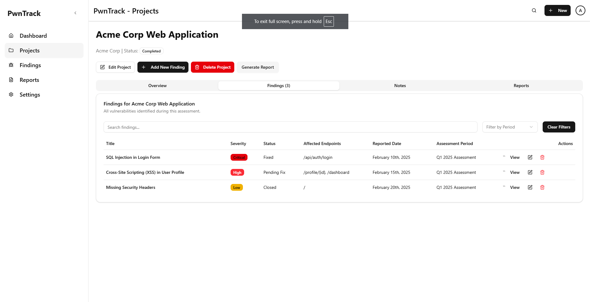

# PwnTrack

**PwnTrack** is a lightweight vulnerability management dashboard tailored for **bug bounty hunters** and **security researchers**.
It enables you to track, triage, and monitor vulnerabilities across multiple projects — all in a **minimal, performant, and secure** interface.



---

## ✨ Features

* **Secure Authentication** — Email/password-based auth without external OAuth.
* **Project Management** — Organize vulnerabilities by project.
* **Vulnerability Tracking** — Track *Discovered*, *In Progress*, and *Resolved* issues.
* **Progress Visualization** — Charts and filters for project and global dashboards.
* **Report Drafting** — Prepare vulnerability reports for responsible disclosure.
* **Minimalist UI** — Powered by [shadcn/ui](https://ui.shadcn.com) and [Tailwind CSS](https://tailwindcss.com) for clarity and speed.
* **Privacy-Focused** — Data stays with you; no telemetry.

---

## 📦 Tech Stack

| Layer      | Technology                                               |
| ---------- | -------------------------------------------------------- |
| Frontend   | [Next.js 14](https://nextjs.org)                         |
| Styling    | [Tailwind CSS](https://tailwindcss.com)                  |
| Components | [shadcn/ui](https://ui.shadcn.com)                       |
| Charts     | [Recharts](https://recharts.org)                         |
| Auth       | [NextAuth.js](https://next-auth.js.org) (Email/Password) |
| Forms      | [React Hook Form](https://react-hook-form.com)           |

---

## 🚀 Getting Started

### 1. Prerequisites

Ensure you have the following installed:

* **Node.js** `>=20.0.0` — [Download](https://nodejs.org)
* **pnpm** `>=9.0.0` — [Install](https://pnpm.io/installation)
* **Git** — [Download](https://git-scm.com)

---

### 2. Installation

```bash
# Clone the repository
git clone https://github.com/yourusername/pwntrack.git
cd pwntrack

# Install dependencies
pnpm install
```

---

### 3. Setup Environment Variables

Create a `.env.local` file in the project root:

```bash
NEXTAUTH_SECRET=your-random-secret
NEXTAUTH_URL=http://localhost:3000
DATABASE_URL=your-database-connection-string
```

> ⚠️ **Security Note:**
>
> * Use a strong, randomly generated `NEXTAUTH_SECRET`.
> * Keep `.env.local` out of version control.
> * Use secure storage for production secrets.

---

### 4. Configure shadcn/ui

```bash
# Initialize shadcn/ui
pnpm dlx shadcn-ui@latest init
```
---

### 5. Run the Development Server

```bash
pnpm dev
```

Visit **[http://localhost:3000](http://localhost:3000)**.

---

## 📂 Project Structure

```
pwntrack/
├── app/               # Next.js app router pages & layouts
├── components/        # Reusable UI components
│   └── auth/          # Login, Signup forms
├── lib/               # Utilities, config
├── public/            # Static assets
├── styles/            # Tailwind styles
└── docs/              # Documentation & screenshots
```

---

## 🔐 Authentication & Access Control

* All routes except `/login` and `/signup` are **protected**.
* Unauthenticated users are redirected to `/login`.
* Authentication is **session-based** (NextAuth.js with credentials provider).

---

## 📜 License

**PwnTrack** is released under the **MIT License**.
See [LICENSE](LICENSE) for details.

---

## ⚠️ Legal Disclaimer

PwnTrack is designed for **lawful security research** and **bug bounty program participation**.
The developers assume **no liability** for any misuse of this software.
Always ensure you have **explicit permission** before testing any systems.

---

## 🤝 Contributing

Pull requests are welcome. Please:

* Follow the established code style.
* Write clear commit messages.
* Include relevant documentation updates.

---

## 📧 Contact

For issues, feature requests, or security concerns:

* **Email:** [security@pwntrack.com](mailto:security@pwntrack.com)
* **GitHub Issues:** [Open a ticket](https://github.com/yourusername/pwntrack/issues)

---
